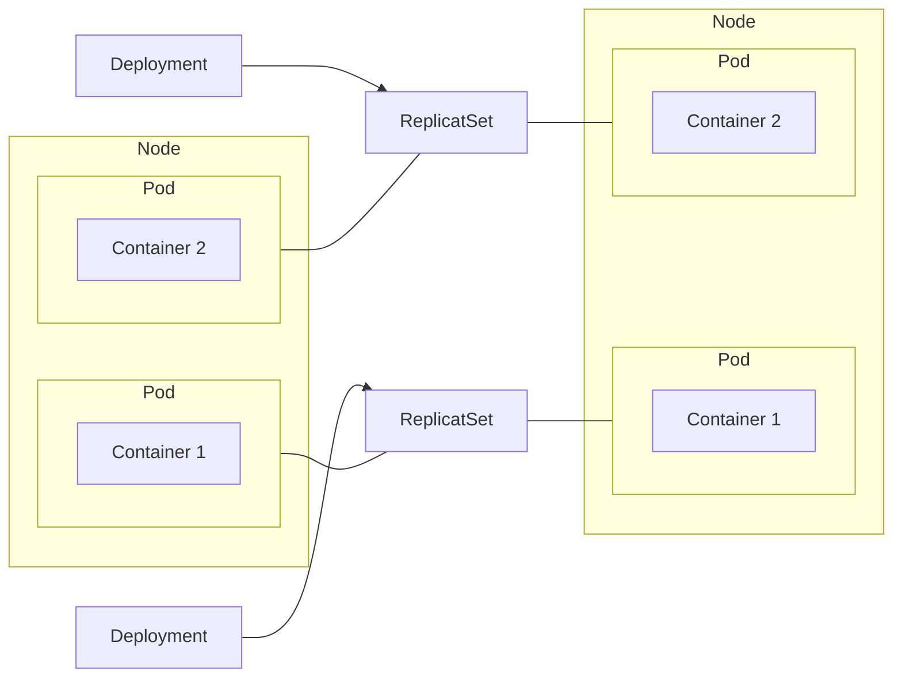
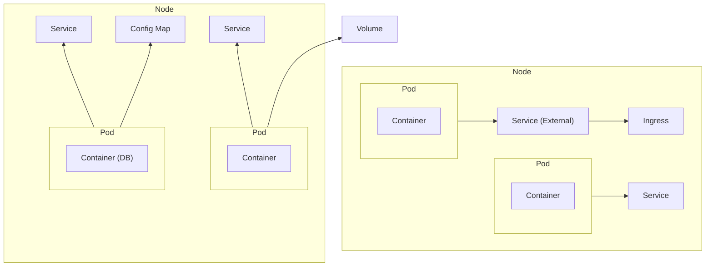
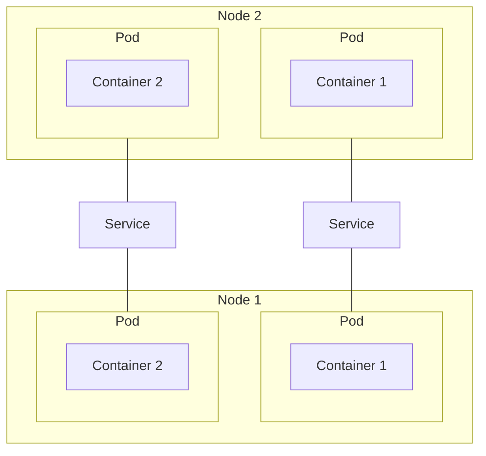
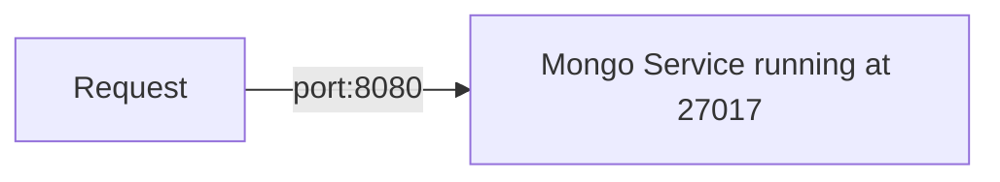
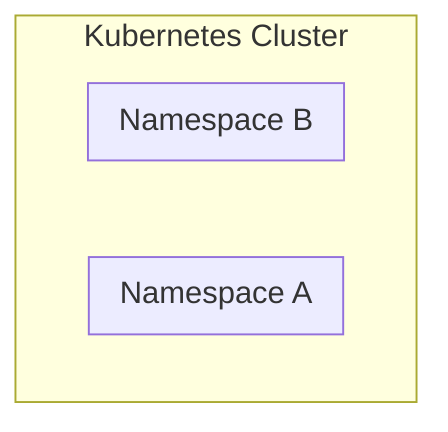
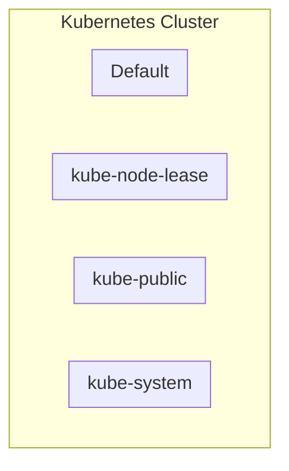

# Label
- Labels == Tags. 
- You can give any K8s component a label
- Labels are **key/value** pairs that are attached to K8s resources
- **Identifier**, which should be meaningful and relevant to users

# Label Selectors
Which Pods belongs to Deployment?

- Identify a set of resources
- Match all Pods with label `app: mongoDB` (there is nothing special about the key `app`, it's just a convention)


```yaml
spec:
  selector:
    matchLabels:
      app: mongodb # <----- Will match all Pods
  template:
    metadata:
      labels:
        app: mongodb # <----- with the same label
```


# Configuration File
Each component configuration will have 3 parts:
1. Metadata
2. Specification (`spec`), specific to each components
3. Status. Automatically generated by K8s to check the current state versus the desired state. If there is a difference, K8s will fix it. This is the basis of the self-healing feature of K8s. This information comes from [[#^3402e8|ETCD]]

It's a good practice to keep the configuration files as part of the code base. Can thus be versioned and be part of the whole IAAS.

# Components
## Deployment 
["](https://kubernetes.io/docs/concepts/workloads/controllers/deployment/)
A Deployment is an abstraction on top of a Pod (which is an abstraction on top of containers)
It specifies, among other things, the number of replicas of a Pod.

A Deployment is StateLESS, as opposed to StatefulSet



Deployment manages a ReplicaSet
ReplicatSet manages a Pod
Pod is an abstraction of a container


## StatefulSet
A StatefulSet is StateFUL (e.g. databases). Stateful pods are complicated to manage, so it’s often easier to manage those things outside K8s, such as databases. 

## Node
Basically a physical machine or a virtual one.



## Volume
- External storage, outside the pod. For persistence. We don't want the data to die in case a pod dies
- The Volume can be on the same physical machine as the Pod or remote, outside of the K8s cluster.
- K8s DO NOT manage data persistence. It's up to the user to setup the appropriate redundancies and backups solutions.

## Service
Because each Pod gets assigned a new IP address on creation, Service is used to make it static to outside users. 
- A Service has two main jobs:
    1. Permanent IP address
    2. Load balancer. If there a replicas of Nodes, then the Service will balance the load between all the replicas.
- Lifecycle of Service and Pod are not connected
- If a Pod needs to be recreated for whatever reason, Service will take care of it and provide the same IP address to users
- Service can be of type:
    - External: Reachable outside
        Has an IP address that looks like `https:\\12.23.34.45:8000`, so an [[#Ingress]] is used
    - Internal: Only reachable by K8s components



- Forwards the request to its end point pods. Identifies which port of the Pod to use via `spec>ports>targetPort`
- The service itself can run on any port, defined in `spec>ports>port`
- Identifies which Pods to send to via `spec>selector` in the Service config

### Config

The Service knows what [[#Deployment]] it should "manage" by linking its own label selector (`spec>selector`) with the Deployment `metadata>labels`.

Unclear how and why, but it will also check the labels of each Pods `template>metadata>labels`

```yaml
# https://kubernetes.io/docs/concepts/services-networking/service/
apiVersion: v1
kind: Service
metadata:
  name: mongo-service
spec:
  selector:
    app: mongoDB # Needs to be the same as the Deployment label (under metadata)
  type: ClusterIP
  ports:
  - name: mongo-service
    protocol: TCP
    port: 8080 # What port to expose
    targetPort: 27017 # Port specified by the Deployment template section
```


#### Internal VS External
A service can be either internal, different pods communicating together, or external for other things (e.g. humans) to have access to is.

For external, set type to `type: LoadBalancer`


## Ingress
Provides a user friendly URL

## ConfigMap
- yaml file
- External configuration of the application

## Secret
- yaml file
- Used to store secret data
- base64 encoded. For example, a user and password would be base64 encoded and copied in this file

## Pods
- On creation, each pod gets assigned a new IP address
- A Pod is an abstraction over a container. While Docker is the most typical containerization technology used, it's not the only one. 
- Smallest unit in K8s
- All replicas of a pod will have the same [[#Label|labels]]
- The specs of a pod is under `spec>template` in the yaml
- If we need environment variables for the containers, they can be put under `env`
    - Additionally, it can be a reference to a secret set in a yaml config of kind `Secret`
- Usually contains only one container

```yaml
apiVersion: apps/v1
kind: Deployment
metadata:
  name: mongo-deployment
  labels:
    app: mongoDB # As far as I can tell, this has no link to Pods labels
spec:
  selector:
    matchLabels:
      app: mongodb
  replicas: 1
  # This is the config for the pods.
  template:
    metadata:
      labels:
        app: mongodb
    spec:
      # initContainers:
        # Init containers are exactly like regular containers, except:
          # - Init containers always run to completion.
          # - Each init container must complete successfully before the next one starts.
      containers:
      - name:  mongodb
        image:  mongo:latest
        ports:
          -containerPort: 27017 # port where MongoDB will run. Specific to each container
        env:
          - name: MONGO_INITDB_ROOT_USERNAME
            valueFrom: 
              secretKeyRef:
                name: mongo-secret # name of the config file
                key: mongo-user
          - name: MONGO_INITDB_ROOT_PASSWORD
            valueFrom: 
              secretKeyRef:
                name: mongo-secret
                key: mongo-password

```


# K8s Architecture

## Workers

- These are the nodes/servers that execute the work
- 3 processes must be installed on every Node (via Ansible?)
    1. Container runtime (e.g. Docker)
    2. Kubelet ^587766
        - interacts with both the container and node
        - Starts pod with a container inside. Command comes from the [[#Master Node]]
    3. Kube Proxy: intelligent forwarding logic inside. If an application can be answered by another application (pod) on the same node, it will prioritize that one instead of having the overhead of going to another node

## Master Node
- 4 processes on every master node (via Ansible?)
    1. API server: ^a3baaa
        - cluster gateway
        - Acts as a gatekeeper for authentication
    2. Scheduler
        - Assign a pod to a Node based on the required and available resources (info available in etcd). Command is sent to the slave’s Kubelet process
    3. Controller Manager: 
        - restart dead pods by telling the scheduler to send that request to the [[#^587766|kubelet]]
    4. ETCD is the cluster brain. Cluster changes get stored in the key/value store.  ^3402e8

# Tools

## minikube
The [[#Master Node]] and [[#Workers]] are running on the same machine. Use `minikube`. It will create a virtual box and start the master/slave processes. 
Need to install the actual virtualization software. 

`minikube start --vm-driver=hyperkit`

It only starts/stop the cluster. Managing the config is done via [[#kubectl]]

## kubectl
Interacts with the [[#^a3baaa|API Server]] on the master node of the K8s cluster


# Namespace



## 4 namespaces exists by default

Get the existing namespace with `kubectl get namespace`



Only use Default or any other namespace you define

Create a new namespace with `kubeclt create namespace my-namespace`

Might as well start using namespace to get used to it and it doesn't cost anything. 

1. Structure your components
2. Avoid conflicts between teams
3. Share Services between different environments (staging vs prod, Blue/Green deployment)
4. Access and Resource Limits on Namespaces level

## Use a namespace
Simply add `namespace` in the metadata of a component

```yaml
apiVersion: apps/v1
kind: Deployment
metadata:
  name: mongo-deployment
  namespace: my-namespace # Here
```

Or on cli
`kubectl apply -f mysql-configmap.yaml --namespace=my-namespace`
