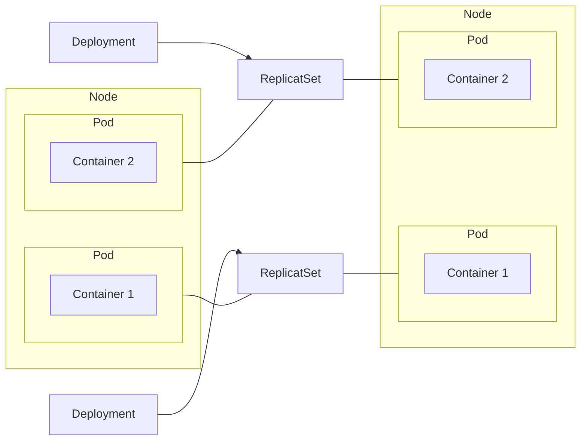

[doc](https://kubernetes.io/docs/concepts/workloads/controllers/deployment/)
- We typically don't work directly with a [[Pod]], but rather with Deployments.
A Deployment is an abstraction on top of a [[Pod]] (which is an abstraction on top of containers)
It specifies, among other things, the number of replicas of a [[Pod]].

A Deployment is StateLESS, as opposed to [[StatefulSet]]. Meaning that it's normally used for things that can be created and destroyed without consequences with respect to data or any states.




Deployment manages a [[ReplicaSet]], which manages a [[Pod]], which is an abstraction of a container.


> [!important]
> See [[Daemon Set]] for the replica count. If you have a [[Daemon Set]], you do not need to specify the replica count as that will manage it for you.


## Config

A Deployment config is a `yaml` file. The file will have a standard section and a template section. The template is how the deployment/pods needs to be configured. 

```
azureuser@master-node:~$ kubectl create deployment my-deployment-name -o yaml --dry-run="client" --image=nginx

apiVersion: apps/v1
kind: Deployment
metadata:
  creationTimestamp: null
  labels:
    app: my-deployment-name
  name: my-deployment-name
spec:
  replicas: 1
  selector:
    matchLabels:
      app: my-deployment-name
  strategy: {}
  template: # Config of a Pod is here. Specific to each Pod based on the container.
    metadata:
      creationTimestamp: null
      labels:
        app: my-deployment-name
    spec:
      containers:
      - image: nginx
        name: nginx
        resources: {}
status: {}
```


> [!Question] Where do we find the specific template part for each deployment?
> 

A deployment know which pods to manage via the selector `spec>selector>matchLabels` to the pod’s template label `spec>template>metadata>labels`

