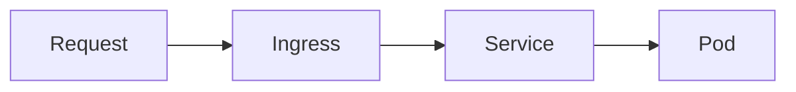

An Ingress is more for human readability. It will change the [[Service/Service]]'s address from `http://node-ip:port` to `https://my-app.com`

```mermaid
flowchart LR
    Request --> Ingress --> Service --> Pod
```
