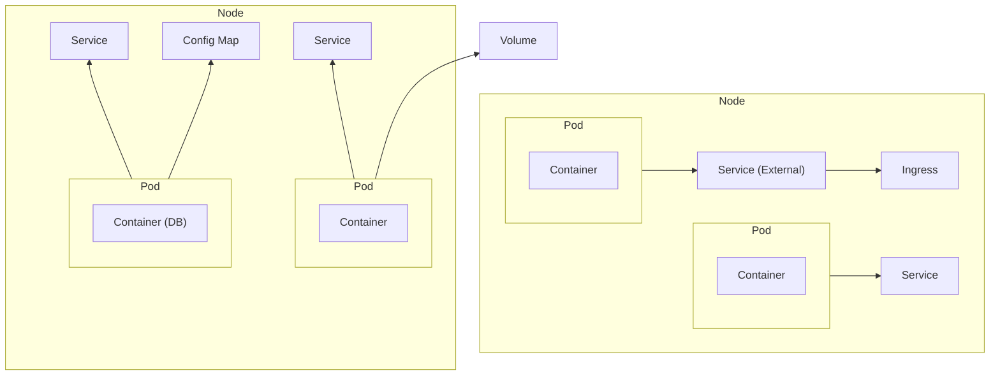

Basically a physical machine or a virtual one.
Multiple [[Pod|Pods]] run on nodes

```mermaid
flowchart BT
    subgraph node2 [Node]
        direction LR
        subgraph pod3[Pod]
            container3[Container]
        end
        pod3 --> service3["Service (External)"]
        service3 --> ingress3[Ingress]
        subgraph pod4[Pod]
            container4[Container]
        end
        pod4 --> service4[Service]
    end
    subgraph node1 [Node]
        direction LR
        subgraph pod1[Pod]
            container1["Container (DB)"]
        end
        pod1 --> service1[Service]
        pod1 --> configmap1["Config Map"]
        subgraph pod2[Pod]
            container2[Container]
        end
        pod2 --> service2[Service]
        
    end
    pod2 --> volume[Volume]
```
