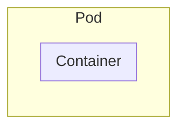

---
aliases:
  - pods
  - Pods
  - pod
---


> [!summary]
> A Pod is an abstraction over a container.  While Docker is the most typical containerization technology used, it's not the only one. We only interact with the Pod and not the container. That means you can work with K8s without knowing anything about Docker.
> 
> A Pod also solve the port allocation problem. Hundreds of containers could run on the same node and they could conflict in the port they use. So a Pod maps the container's internal port to an external one. The external one can be managed by the whole K8s system. You only need to worry about port allocation inside a Pod and since you will generally run only one container it's not a problem.




- On creation, each pod gets assigned a new, internal, IP address. Not accessible outside the cluster
- Smallest unit in K8s
- All replicas of a pod will have the same [[#Label|labels]]
- The specs of a pod is under `spec>template` in the yaml
- If we need environment variables for the containers, they can be put under `env`
    - Additionally, it can be a reference to a secret set in a yaml config of kind `Secret`
- Usually contains only one container

```yaml
apiVersion: apps/v1
kind: Deployment
metadata:
  name: mongo-deployment
  labels:
    app: mongoDB # As far as I can tell, this has no link to Pods labels
spec:
  selector:
    matchLabels:
      app: mongodb
  replicas: 1
  # This is the config for the pods.
  template:
    metadata:
      labels:
        app: mongodb
    spec:
      # initContainers:
        # Init containers are exactly like regular containers, except:
          # - Init containers always run to completion.
          # - Each init container must complete successfully before the next one starts.
      containers:
      - name:  mongodb
        image:  mongo:latest
        ports:
          -containerPort: 27017 # port where MongoDB will run. Specific to each container
        env:
          - name: MONGO_INITDB_ROOT_USERNAME
            valueFrom: 
              secretKeyRef:
                name: mongo-secret # name of the config file
                key: mongo-user
          - name: MONGO_INITDB_ROOT_PASSWORD
            valueFrom: 
              secretKeyRef:
                name: mongo-secret
                key: mongo-password

```


## Connect to

`kubectl exec -it <name of the pod> —- <linux command>`

`kubectl exec -it test-nginx-svc —- bash`