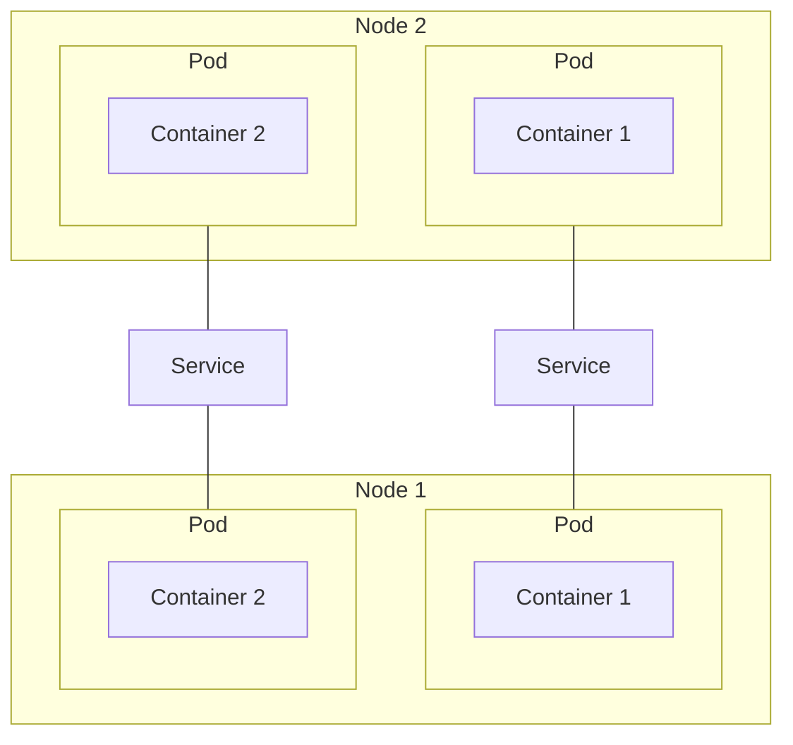
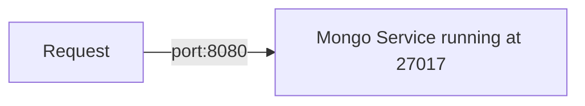

Because each Pod gets assigned a new IP address on creation, Service is used to make it static/permanent to outside users. 
- A Service has two main jobs:
    1. Permanent IP address
    2. Load balancer. If there a replicas of Nodes, then the Service will balance the load between all the replicas.
- Lifecycle of Service and Pod are not connected. If a [[Pod]] needs to be recreated for whatever reason, Service will take care of it and provide the same IP address to users
- Service is not a process that run on a node, it’s simply a virtual address, a mapping in a sense. It gets a request, maps it to the pod internal IP address, and [[../../tools/kubeproxy|kubeproxy]] sends the request to the pod




- Forwards the request to its end point pods. Identifies which port of the Pod to use via `spec>ports>targetPort`
- The service itself can run on any port, defined in `spec>ports>port`
- Identifies which Pods to send to via `spec>selector` in the Service config

### Type of Services
- Service can be of two types
#### External
Reachable outside. Has an IP address that looks like `http://node-ip:port`, so an [[#Ingress]] is used

#### Internal
Only reachable by K8s components

### Config

The Service knows what [[Deployment]] it should "manage" by linking its own label selector (`spec>selector`) with the Deployment pod config template `spec>template>metadata>labels`. So it will “select” the **pod** with the specified key:value pair. 


```yaml
# https://kubernetes.io/docs/concepts/services-networking/service/
apiVersion: v1
kind: Service
metadata:
  name: mongo-service
spec:
  selector:
    app: mongoDB # Needs to be the same as the Deployment label (under metadata)
  type: ClusterIP
  ports:
  - name: mongo-service
    protocol: TCP
    port: 8080 # What port to expose
    targetPort: 27017 # Port specified by the Deployment template section
```


#### Internal VS External
A service can be either internal, different pods communicating together, or external for other things (e.g. humans) to have access to is.

For external, set type to `type: LoadBalancer`

## Validate

Run this command. You should see the list of IP addresses of the [[Pod|pods]] that are serviced by this service

```
azureuser@master-node:~$ kubectl get endpoints # kubectl get ep also works
NAME            ENDPOINTS                   AGE
kubernetes      10.1.0.4:6443               16d
nginx-service   10.44.0.2:80,10.44.0.3:80   12m
```

Alternatively, you can also run describe

```
azureuser@master-node:~$ kubectl describe svc nginx-service
Name:              nginx-service
Namespace:         default
Labels:            <none>
Annotations:       <none>
Selector:          app=nginx
Type:              ClusterIP
IP Family Policy:  SingleStack
IP Families:       IPv4
IP:                10.99.144.79
IPs:               10.99.144.79
Port:              <unset>  8080/TCP
TargetPort:        80/TCP
Endpoints:         10.44.0.2:80,10.44.0.3:80      # Now we have the IP addresses of the pods
Session Affinity:  None
Events:            <none>
```


##### Troubleshoot

###### Service Endpoints empty in description

```yaml
apiVersion: apps/v1
kind: Deployment
metadata:
  labels:
    app: nginx
  name: nginx-deployment
spec:
  replicas: 2
  selector:
    matchLabels:
      app: ngnix
  template:
    metadata:
      labels:
        app: ngnix
    spec:
      containers:
      - image: nginx
        name: nginx
        ports:
        - containerPort: 80
```

```yaml
apiVersion: v1
kind: Service
metadata:
  name: nginx-service
spec:
  selector:
    app: nginx
  ports:
    - protocol: TCP
      port: 8080
      targetPort: 80
```

After applying a Service, we should see `Endpoints` filled with the IP addresses of the pods with the proper label (e.g. `app: nginx` above). 

```
azureuser@master-node:~$ kubectl describe svc nginx-service
Name:              nginx-service
Namespace:         default
Labels:            <none>
Annotations:       <none>
Selector:          app=nginx
Type:              ClusterIP
IP Family Policy:  SingleStack
IP Families:       IPv4
IP:                10.99.144.79
IPs:               10.99.144.79
Port:              <unset>  8080/TCP
TargetPort:        80/TCP
Endpoints:         <none>     # This should be filled with IP addresses
Session Affinity:  None
Events:            <none>
```

Turns out that you may have simply misspelled the label `app: nginx` (look at the deployment yaml, `nginx` reads `ngnix`)

```
azureuser@master-node:~$ kubectl describe svc nginx-service
Name:              nginx-service
Namespace:         default
Labels:            <none>
Annotations:       <none>
Selector:          app=nginx
Type:              ClusterIP
IP Family Policy:  SingleStack
IP Families:       IPv4
IP:                10.99.144.79
IPs:               10.99.144.79
Port:              <unset>  8080/TCP
TargetPort:        80/TCP
Endpoints:         10.44.0.2:80,10.44.0.3:80      # Now we have the IP addresses of the pods
Session Affinity:  None
Events:            <none>
```

```
azureuser@master-node:~$ kubectl get pod -o wide
NAME                                  READY   STATUS    RESTARTS   AGE     IP          NODE           NOMINATED NODE   READINESS GATES
nginx-deployment-7c5ddbdf54-h877d     1/1     Running   0          4m28s   10.44.0.2   worker-node-1   <none>           <none>
nginx-deployment-7c5ddbdf54-xsgvk     1/1     Running   0          4m28s   10.44.0.3   worker-node-1   <none>           <none>
```


### curl the service

Create a temporary pod so we can get in it and curl to the service.
`kubectl run test-nginx-svc --image=nginx`

Get the IP of the newly created service `nginx-service` 
```
azureuser@master-node:~$ k get svc
NAME            TYPE        CLUSTER-IP     EXTERNAL-IP   PORT(S)    AGE
kubernetes      ClusterIP   10.96.0.1      <none>        443/TCP    16d
nginx-service   ClusterIP   10.99.144.79   <none>        8080/TCP   38m  # This one
```

Jump into the new pod `k exec -it test-nginx-svc -- bash`
Curl the IP and the DNS
`curl http://10.99.144.79:8080 `
`curl http://nginx-service:8080 `

Both should return the same thing. If not, then there is a problem with the DNS, the Pod cannot find the IP address from the name

## Configure Service IP address

Change the CIDR block used. Change the yaml file for `kube-apiserver.yaml`, option `--service-cluster-ip-range=`

```
azureuser@master-node:~$ sudo vi /etc/kubernetes/manifests/kube-apiserver.yaml 
```

No need to do anything afterward, it will be detected automatically. The old services IP won't be changed. This only applies to new services.

Alternatively print the default [[kubeadm]] config parameters.