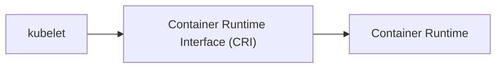

---
url:
  - https://kubernetes.io/docs/setup/production-environment/container-runtimes/
---
> [!summary]
> [[tools/containerd|containerd]] and [[tools/cri-o|cri-o]] are the most popular runtime (and not Docker). They can run Docker container regardless

#### Container Runtime
- Separate application, not a Kubernetes component
- Kubernetes uses the container runtime to schedule the containers

Every applications, including K8s processes ([[Architecture/Worker#Processes|Worker processes]], [[Architecture/Master#Processes|Master processes]]), run in a container.

> [!idea]- History
> K8s initially ran only Docker. As time passed, other container technology emerged. So K8s created an interface so that every runtime (e.g. Docker, ContainerD, CRI-o) could plug into it. K8s did not take the responsability to develop and maintain all the 
> runtime options.
> For a while, K8s developed the interface for Docker, called `dockershim`, but is not longer maintaining it. No worries, `ContainerD` can run Docker containers just the same.
> Docker has a whole bunch of technology surrounding it (e.g. UI, server, compose, CLI, etc) and not just the runtime. K8s just need the runtime. Since other technologies, such as `ContainerD`, are more lightweight and can run Docker, it's what most services use (e.g. AKS, EKS, ...)

    

        
Jan 1, 2020

        
New Year Celebration

    

    

        
Jan 2, 2020

        
New Year Celebration

    

