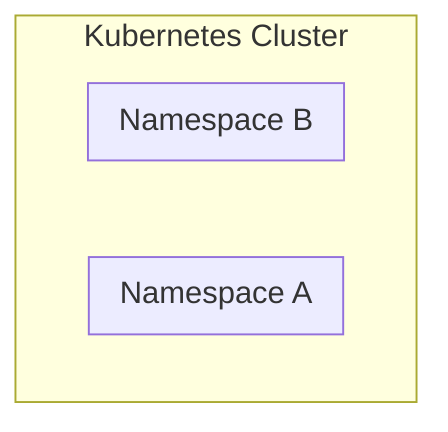
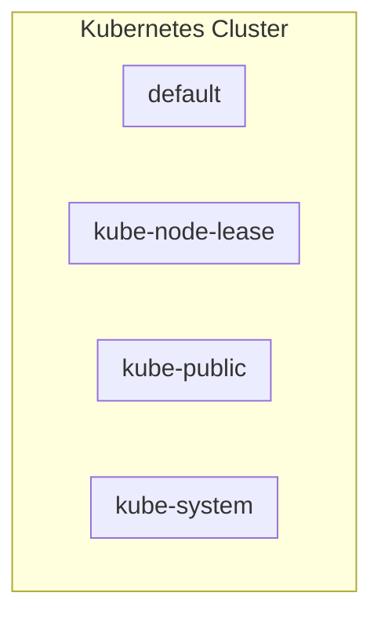

Namespaces are meant to:
1. Structure your components
2. Avoid conflicts between teams
3. Share services between different environment (e.g. blue/green deployment)
4. Access and Resource Limits on Namespaces level



## Cross namespace
Not sure how to call that, but you can still refer to another namespace's component by pointing to it `other_namespace.component`

## 4 namespaces exists by default

Get the existing namespace with `kubectl get namespace`



Only use Default or any other namespace you define


## Create a new namespace

### Option 1 - CLI
Create a new namespace with `kubeclt create namespace my-namespace`

### Option 2 - Config file


Might as well start using namespace to get used to it and it doesn't cost anything. 

1. Structure your components
2. Avoid conflicts between teams
3. Share Services between different environments (staging vs prod, Blue/Green deployment)
4. Access and Resource Limits on Namespaces level

## Use a namespace
Simply add `namespace` in the metadata of a component

```yaml
apiVersion: apps/v1
kind: Deployment
metadata:
  name: mongo-deployment
  namespace: my-namespace # Here
```

Or on cli
`kubectl apply -f mysql-configmap.yaml --namespace=my-namespace`

