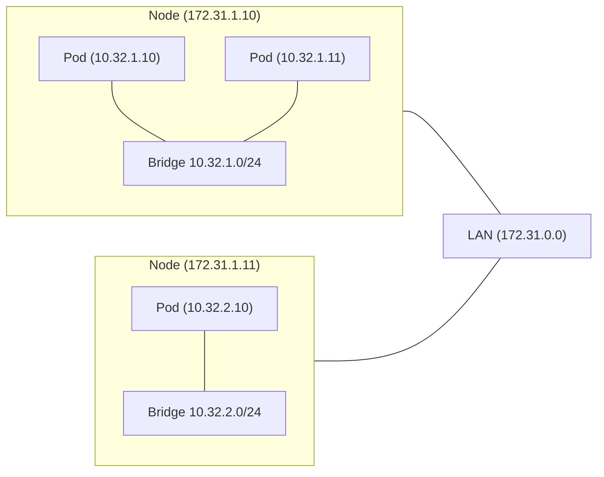

---
aliases:
  - CNI
url:
  - https://kubernetes.io/docs/concepts/cluster-administration/addons/
---

> [!Summary] 
> Container Network Interface is a set of rules to are design for Pod-to-Pod communcation

K8s imposes requirements for a Container Network Interface to be usable
1. Every [[../Components/Pod|Pod]] gets it own unique IP address **across all nodes**. It must be unique in the whole cluster.
2. Pods on the same Node can communicate with that IP address
3. Pods on a different [[../Components/Node|Node]] can communication with that IP address without NAT (Network Address Translation)

![[../images/Pasted image 20240103162636.png|400]]

- The [[../../networking/VPC|virtual private cloud]] provides a range of IP adresses that can be used by the nodes (e.g. 172.31.0.0/16).
- In each [[../Components/Node|Node]], a private network exists. Pods will use an IP address in that private network. The IP addresses for the Pods are defined by the [[#Solutions]] that implements CNI. (e.g. 10.32.0.0/12)

## Solutions
https://kubernetes.io/docs/concepts/cluster-administration/addons/

Third party solutions are:

- Flannel
- WeaveWorks
- Cilium
- VMware NSX