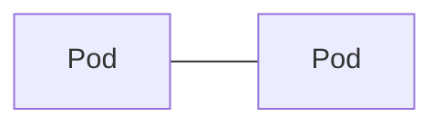
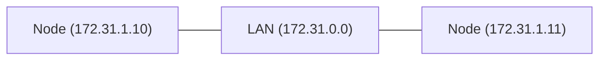
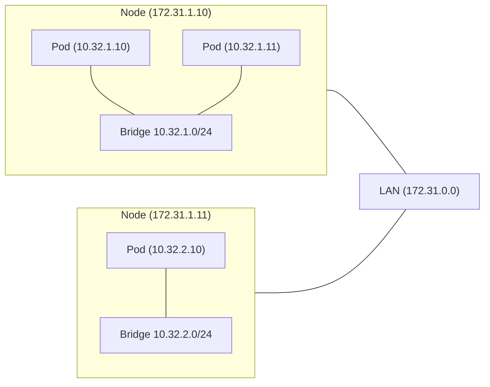

How Pod Networking look like?


How Pods communicate on across different Nodes

A [[../Components/Pod|Pod]] takes care of abstracting the port needed by the containers. The same container could run multiple times (or multiple containers could use the same port) without conflict because a [[Pod]] maps the container's port (inside the Pod) to other pods and components. This abstraction allows a common management of ports and IP addresses. 

## Pod to Pod communication



There is not built-in solution for pod-to-pod communication, but K8s imposes fundamental requirements ([[Container Networking Interface|CNI]]) on any implementation to be pluggable into K8s. Third party solutions need to implement this.


### On the same Node
Each Node gets an IP address from IP range on our Virtual Private Cloud (VPC)
Nodes belong to the same private network






On each Node, a private network (bridge/switch) with a **different IP range** is created. Very important, the IP address ranges cannot overlap otherwise the Pod communication in the cluster will not work. Still, they are local to the Node.

Also important, the IP range for the Nodes cannot overlap with the IP range for the Pods.

The [[Container Networking Interface#Solutions|third party]] tool will reserve a large bloc of IP addresses and assign each Node an equal subset.

So how does 10.32.1.10 talks to 10.32.2.10?

### On different Nodes

There is a mapping between the internal IP addresses and the IP address of its Node. The communication is done via a Gateway (IP address of the Nodes).

| Network | Gateway |
| ---- | ---- |
| 10.32.1.0/24 | 172.31.1.10 |
| 10.32.2.0/24 | 172.31.1.11 |
| 10.32.3.0/24 | 172.31.2.10 |

That's why the IP addresses cannot overlap between the different nodes.


> [!question] Why not directly use the IP addresses of the Pods?
> Since all the IP addresses are unique, why go through the Gateway? Could we not simply have a list of IP addresses that are "public" inside the cluster?


Not sure if this is specific to the solution implementation or part of [[CNI]], but WeaveNet installs a bunch of peers on all the nodes so that they can talk to each other directly. They can ask in the group who can respond to a specific Pod IP address. So I think it bypasses the Gateway.

## WeaveNet Installation

Pretty simple. Section Installation here https://www.weave.works/docs/net/latest/kubernetes/kube-addon/
One line to run on the [[../Architecture/Master|master node]].
Then we can see that the STATUS is ready 

```
azureuser@master-node:~$ kubectl get node
NAME          STATUS   ROLES           AGE   VERSION
master-node   Ready    control-plane   16d   v1.29.0
```

The [[../Architecture/Worker|worker node]] have not yet been initialized. Initializing the master node was a prerequisite for the worker nodes.


## Join worker nodes to the cluster

During `kubeadm init` on the master node, there was a command printed out to join worker nodes to the cluster. Either you saved it or you get a new one with this (run on the master node)
```
$ kubeadm token create --print-join-command
kubeadm join 10.1.0.4:6443 --token bclzqa.939krqkcga8rfw99 --discovery-token-ca-cert-hash sha256:7bedaf398d08daf8dca4567de3a1cfe06c3ab8f886b949641b7761b57c21a768 
```

Run that command as `sudo` 

```shell
$ sudo kubeadm join 10.1.0.4:6443 --token bclzqa.939krqkcga8rfw99 --discovery-token-ca-cert-hash sha256:7bedaf398d08daf8dca4567de3a1cfe06c3ab8f886b949641b7761b57c21a768 
```

### Validate
On the master node, you should be able to see the worker node listed `kubectl get node`
You should also see the weave-net CNI pod running `kubectl get pod -n kube-system`

#### Troubleshoot
See [[../Troubleshooting#[preflight ] Some fatal errors occurred|Troubleshooting]]


